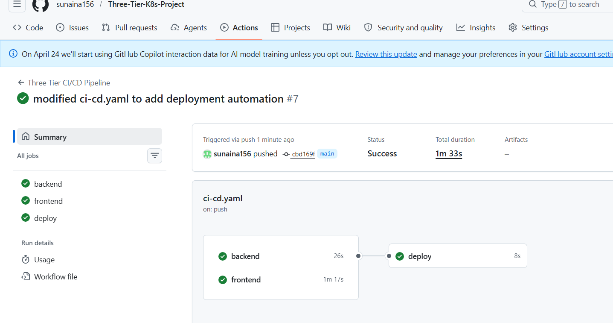
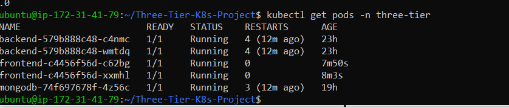
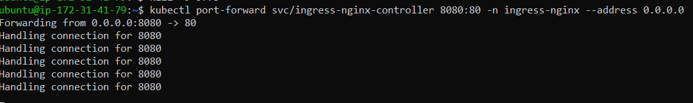
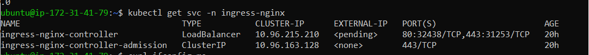
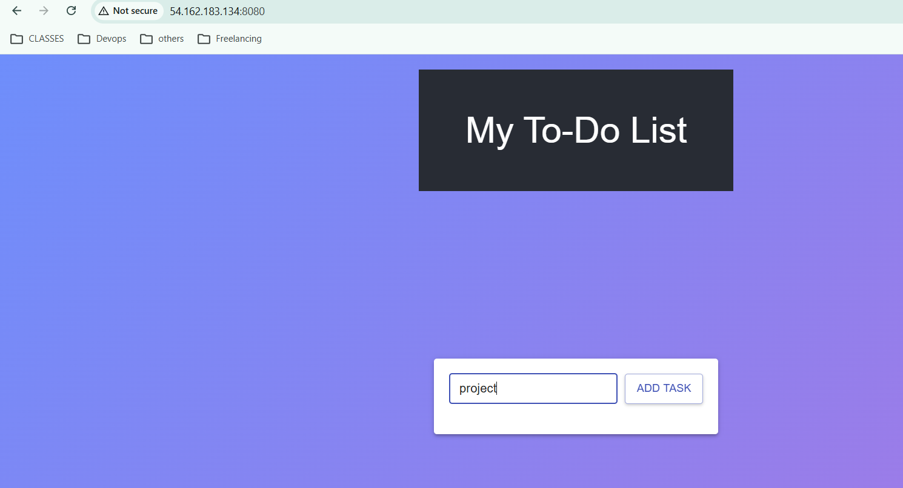

# Three-Tier Todo Application on Kubernetes

A full-stack three-tier Todo application deployed on Kubernetes using Docker, AWS EC2, KIND cluster, MongoDB, NGINX Ingress Controller, and GitHub Actions CI/CD.

This project demonstrates containerization, Kubernetes orchestration, ingress-based routing, persistent storage management, secret handling, and automated CI/CD workflows for deploying a modern cloud-native application.

---

# Architecture

```text
                     User
                       │
                       ▼
          NGINX Ingress Controller
                       │
         ┌─────────────┴─────────────┐
         ▼                           ▼
Frontend Service              Backend Service
   (React)                  (Node.js / Express)
                                       │
                                       ▼
                                  MongoDB
                                       │
                                       ▼
                         Persistent Volume (PV)
```

---

# Tech Stack

## Frontend
- React.js

## Backend
- Node.js
- Express.js

## Database
- MongoDB

## DevOps / Cloud
- Docker
- Kubernetes
- KIND Cluster
- AWS EC2
- GitHub Actions
- DockerHub
- NGINX Ingress Controller

---

# Features

- Containerized frontend and backend applications
- Kubernetes-based deployment and orchestration
- Persistent storage for MongoDB using PV and PVC
- Secure secret management using Kubernetes Secrets
- Environment variable management using ConfigMaps
- Health monitoring using liveness and readiness probes
- Ingress-based routing using NGINX Ingress Controller
- Automated Docker image build and push using GitHub Actions
- Automated Kubernetes deployment updates through CI/CD pipeline

---
# Kubernetes Components Used

- Namespace
- Deployment
- Service
- ConfigMap
- Secret
- PersistentVolume (PV)
- PersistentVolumeClaim (PVC)
- Ingress
- Liveness Probe
- Readiness Probe

---

# Project Structure

```text
Three-Tier-K8s-Project/
│
├── backend/
│
├── frontend/
│
├── k8s_manifests/
│   ├── backend/
│   ├── frontend/
│   ├── database/
│   ├── config/
│   ├── ingress.yaml
│   └── namespace.yaml
│
└── .github/
    └── workflows/
        └── ci-cd.yaml
```

---

# Infrastructure Setup

The Kubernetes cluster was deployed on an AWS EC2 Ubuntu instance using KIND (Kubernetes IN Docker).

## Launch EC2 Instance

Launch an Ubuntu EC2 instance and allow the following ports in the Security Group:

| Port | Purpose |
|------|----------|
| 22 | SSH Access |
| 80 | HTTP |
| 443 | HTTPS |
| 8080 | Ingress Access |
| 30007 | NodePort Access (Optional) |

---

## Install Docker

```bash
sudo apt update
sudo apt install docker.io -y
sudo systemctl start docker
sudo systemctl enable docker
```

---

## Install kubectl

```bash
curl -LO "https://dl.k8s.io/release/$(curl -L -s \
https://dl.k8s.io/release/stable.txt)/bin/linux/amd64/kubectl"

chmod +x kubectl
sudo mv kubectl /usr/local/bin/
```

---

## Install KIND

```bash
curl -Lo ./kind https://kind.sigs.k8s.io/dl/latest/kind-linux-amd64

chmod +x ./kind
sudo mv ./kind /usr/local/bin/kind
```

---

## Create KIND Cluster

```bash
kind create cluster --name three-tier-cluster
```

---

## Install NGINX Ingress Controller

```bash
kubectl apply -f https://raw.githubusercontent.com/kubernetes/ingress-nginx/main/deploy/static/provider/cloud/deploy.yaml
```

---

# Project Setup

## Clone Repository

```bash
git clone https://github.com/your-username/Three-Tier-K8s-Project.git

cd Three-Tier-K8s-Project
```

---

## Create Namespace

```bash
kubectl apply -f k8s_manifests/namespace.yaml
```

---

## Deploy Configurations

```bash
kubectl apply -f k8s_manifests/config/
```

---

## Deploy Database

```bash
kubectl apply -f k8s_manifests/database/
```

---

## Deploy Backend

```bash
kubectl apply -f k8s_manifests/backend/
```

---

## Deploy Frontend

```bash
kubectl apply -f k8s_manifests/frontend/
```

---

## Deploy Ingress

```bash
kubectl apply -f k8s_manifests/ingress.yaml
```

---

# Verify Deployment

```bash
kubectl get pods -n three-tier

kubectl get svc -n three-tier

kubectl get ingress -n three-tier
```

---
# GitHub Actions Secrets

The following GitHub repository secrets are required for CI/CD pipeline execution.

| Secret Name | Description |
|-------------|-------------|
| DOCKER_USERNAME | DockerHub username |
| DOCKER_PASSWORD | DockerHub access token |
| EC2_HOST | AWS EC2 Public IP |
| EC2_USER | EC2 SSH username |
| EC2_SSH_KEY | Private SSH key |

---

# CI/CD Pipeline

GitHub Actions was used to automate the application delivery workflow.

## CI/CD Workflow

```text
Developer Pushes Code
          │
          ▼
 GitHub Actions Triggered
          │
          ▼
 Build Docker Images
          │
          ▼
 Push Images to DockerHub
          │
          ▼
 SSH Into EC2 Instance
          │
          ▼
 Apply Kubernetes Manifests
          │
          ▼
 Restart Kubernetes Deployments
```

---

# Application Access

The application was exposed using NGINX Ingress Controller running inside the Kubernetes cluster.

Ingress was used to route external traffic to frontend and backend services.

---

# Useful Commands

## Check Pods

```bash
kubectl get pods -n three-tier
```

---

## Check Services

```bash
kubectl get svc -n three-tier
```

---

## Check Ingress

```bash
kubectl get ingress -n three-tier
```

---

## View Logs

```bash
kubectl logs deployment/frontend -n three-tier

kubectl logs deployment/backend -n three-tier
```

---

# Screenshots

## GitHub Actions Pipeline



--- 
## Kubernetes Pods



---


--


---

# ⚠️ Important Note: Accessing Ingress in KIND Cluster

When using KIND (Kubernetes IN Docker) on an AWS EC2 instance, the Ingress controller service of type LoadBalancer will remain in <pending> state.

This happens because KIND does not integrate with cloud providers like AWS to provision external load balancers.

## Why LoadBalancer does not work
KIND runs inside Docker containers
No native cloud LoadBalancer support
Therefore, EXTERNAL-IP stays <pending>

## Solution Used in This Project

To expose the application externally, kubectl port-forwarding is used.
``` bash
kubectl port-forward svc/ingress-nginx-controller 8080:80 -n ingress-nginx --address 0.0.0.0
```

## Application Access URLs

After port-forwarding:

Frontend
http://<EC2-PUBLIC-IP>:8080/
Backend API
http://<EC2-PUBLIC-IP>:8080/api/tasks


## Application UI




---

# Learning Outcomes

Through this project, I gained hands-on experience with:

- Kubernetes architecture and networking
- Ingress-based routing
- Persistent storage management in Kubernetes
- Container orchestration
- Kubernetes troubleshooting and debugging
- CI/CD automation using GitHub Actions
- Docker image lifecycle management
- Cloud deployment on AWS EC2

---


